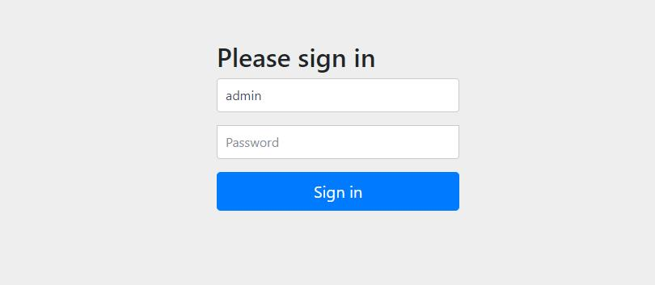

# springsecurity-quickstart

springboot + spring security 整合应用

> 参考: [https://blog.csdn.net/bookssea/article/details/109262109](https://blog.csdn.net/bookssea/article/details/109262109)

## spring security 

Spring Security是一个功能强大且高度可定制的身份验证和访问控制框架。它是保护基于Spring的应用程序的事实标准。

## 快速入门

#### 1. 创建表

```
CREATE TABLE `sys_user` (
  `id` int(11) NOT NULL AUTO_INCREMENT,
  `username` varchar(255) DEFAULT NULL,
  `password` varchar(45) DEFAULT NULL,
  `nickname` varchar(255) DEFAULT NULL,
  `phone` varchar(45) DEFAULT NULL,
  `create_time` datetime DEFAULT NULL,
  `update_time` datetime DEFAULT NULL,
  PRIMARY KEY (`id`)
) ENGINE=InnoDB AUTO_INCREMENT=2 DEFAULT CHARSET=utf8 COMMENT='用户表';
```
#### 2. 添加依赖

```
<!-- spring security -->
<dependency>
    <groupId>org.springframework.boot</groupId>
    <artifactId>spring-boot-starter-security</artifactId>
</dependency>
```

#### 3. 查询测试

- 创建entity实体/创建mapper接口/...

```
略
```

- 创建controller.java文件

```
@GetMapping("/get")
public Object getUser(@RequestParam String username){
    return userMapper.queryByUsername(username);
}
```

- 启动访问: localhost:8003/get?username=user



密码在程序启动中自动生成


> 输入用户名: user, 密码: , 登录成功后访问成功


## 基于数据库认证

#### 1. 创建Security的配置类WebSecurityConfig继承WebSecurityConfigurerAdapter

```
@EnableWebSecurity
public class WebSecurityConfig extends WebSecurityConfigurerAdapter {

    // 指定加密方式
    @Bean
    public PasswordEncoder passwordEncoder(){
        // 使用BCrypt加密密码
        return new BCryptPasswordEncoder();
    }

    // 重写该方法，暴露 authenticationManagerBean
    @Bean
    @Override
    public AuthenticationManager authenticationManagerBean() throws Exception {
        return super.authenticationManagerBean();
    }

    @Override
    protected void configure(HttpSecurity http) throws Exception {
        http
                .authorizeHttpRequests()
                .antMatchers(
                        "/authentication",
                        "/swagger-ui.html", "/webjars/**", "/v2/**", "/swagger-resources/**"
                ).permitAll()
                .anyRequest().authenticated()

                .and()
                .formLogin().disable()

                .csrf().disable();
    }
}
```

#### 2. 新建类用户登录信息类, 继承专用接口UserDetails

```
@Data
@AllArgsConstructor
@NoArgsConstructor
public class LoginUser implements UserDetails {

    private User user;

    @Override
    public Collection<? extends GrantedAuthority> getAuthorities() {
        return null;
    }

    @Override
    public String getPassword() {
        return user.getPassword();
    }

    @Override
    public String getUsername() {
        return user.getUsername();
    }

    @Override
    public boolean isAccountNonExpired() {
        return true;
    }

    @Override
    public boolean isAccountNonLocked() {
        return true;
    }

    @Override
    public boolean isCredentialsNonExpired() {
        return true;
    }

    @Override
    public boolean isEnabled() {
        return true;
    }
}
```

#### 3. 新建类实现UserDetailService接口重写loadUserByUsername方法

> 从数据库读取用户信息进行身份认证

```
@Component
public class UserDetails2Service implements UserDetailsService {

    @Autowired
    private UserMapper userMapper;

    @Autowired
    private PasswordEncoder passwordEncoder;

    @Override
    public UserDetails loadUserByUsername(String username) throws UsernameNotFoundException {
        // 通过用户名从数据库获取用户信息
        User user = userMapper.queryByUsername(username);
        if(user == null) {
            throw new UsernameNotFoundException("用户不存在");
        }

        // 因为数据库是明文，所以这里需加密密码
        user.setPassword(passwordEncoder.encode(user.getPassword()));
        return new LoginUser(user);
    }
}
```

#### 登录&查询测试

- controller

```
@PostMapping("/login")
public Object login(@RequestBody User user) {
    // 认证
    UsernamePasswordAuthenticationToken authenticationToken = new UsernamePasswordAuthenticationToken(user.getUsername(), user.getPassword());

    try{
        Authentication authentication = authenticationManager.authenticate(authenticationToken);

        // 认证失败
        if(Objects.isNull(authentication)) {
            throw new RuntimeException("用户名或密码错误");
        }
        // 将用户信息存SecurityContextHolder，授权也在这一步实现
        SecurityContextHolder.getContext().setAuthentication(authentication);

        // 认证成功
        return (LoginUser) authentication.getPrincipal();
    }catch (Exception e) {
        e.printStackTrace();
        return null;
    }
}
```

> 访问: http://localhost:8003/swagger-ui/index.html